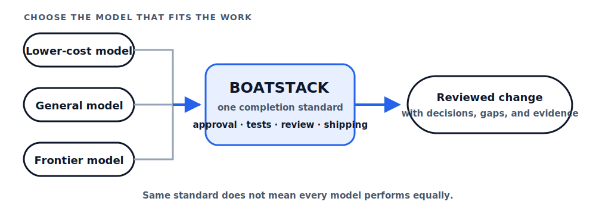

<!-- Generated from operatorstack/intelligence-flow. Edit the upstream public source, not this file. -->

<p align="center">
  
</p>

<h1 align="center">Boatstack</h1>

<p align="center"><strong>Build freely. Prove it. Ship.</strong></p>

## Turn an idea into a change you can review and trust

Boatstack keeps your plan, decisions, tests, review findings, and known gaps attached to the work from idea to PR. Its safeguards come from failures observed in benchmark and product-repository experiments, with what is verified and what is still being evaluated clearly labeled.

It works inside Cursor, Codex, and Claude Code. You keep your model, repository, product documents, and way of building. Boatstack makes the important decisions and evidence visible before anyone claims the change is ready.

## Why these steps?

They come from real coding failures we observed—not guesses. For every safeguard, Boatstack shows what went wrong, what now prevents it, and whether that safeguard has actually been tested.

| What happened | What Boatstack does | How we check it |
|---|---|---|
| <!-- boatstack-claim:human-decisions -->The agent guessed a product decision | It asks, records your answer, and requires approval before code | Approval and drift tests |
| <!-- boatstack-claim:validation-provenance -->“Tests passed” was used to support claims the tests did not cover | It links each promised outcome to the check that can disprove it | Plan compiler and coverage tests |
| <!-- boatstack-claim:irreversible-operations -->A failed external write led to an invented reset path | It denies high-confidence destructive recovery before execution | Host-hook fixtures; overall benefit still being evaluated |
| <!-- boatstack-claim:reviewer-ready-pr -->A PR lost the decisions and gaps behind the change | It builds a review brief from the approved scope, actual diff, and recorded evidence | PR projection and stale-preview tests |

[Read what happened, what is tested, and what remains open](docs/why-these-steps.md). The machine-readable [claim record](docs/public-claims.json) keeps the public wording tied to its sources.

## Install with your coding agent

Copy this into Cursor, Codex, or Claude Code while the repository is open:

```text
Install Boatstack in this repository from https://github.com/operatorstack/boatstack. Detect whether you are running in Cursor, Codex, or Claude Code; create or use a chore/install-boatstack branch; run the official installer for this operating system; default to core unless I request gstack or Spec Kit; keep all portable host adapters; run Boatstack doctor; show me the generated files and installation diff; and prepare the installation PR without merging it or starting product work.
```

Install Boatstack in its own infrastructure PR and merge that PR before starting a feature. This keeps one-time repository setup out of later product diffs.

## Start with two moves

1. Create and save a plan in your coding tool's Plan mode.
2. Run `/auto-plan`.

That is all you need to learn up front. Boatstack shows you one next action at a time through approval, building, tests, review, and PR preparation.

> The diagram below shows what Boatstack guides—not a checklist you need to memorize.

<p align="center">
  
</p>

## Use the model that fits your budget

Boatstack applies the same planning, approval, testing, review, and shipping requirements whichever coding model you choose. Lower-cost models remain an option without lowering the standard required to call the work complete.

<p align="center">
  
</p>

> This does not mean every model performs equally. Boatstack makes the process less dependent on the model catching every mistake by itself.

> **Designed for model flexibility · Quality uplift evaluation in progress**

| Without Boatstack | With Boatstack |
|---|---|
| Quality depends heavily on the model catching every mistake itself | Planning, approval, tests, and review provide additional checks |
| Switching to a lower-cost model may also change the development process | The completion standard stays consistent across models |
| Important context disappears between features | Decisions, gaps, evidence, and code state inform the next feature |

- <!-- boatstack-claim:model-neutral-contract -->**Verified:** Boatstack uses the same completion requirements regardless of model, provider, or price.
- <!-- boatstack-claim:cross-model-failures -->**Observed:** benchmark runs exposed failures in protocol handling, context, verification, and recovery—not only model capability.
- <!-- boatstack-claim:lower-cost-outcomes -->**Being evaluated:** whether this measurably improves product quality or cost when using lower-cost models.

[See the evidence and paired evaluation design](docs/why-these-steps.md#model-choice-and-budget).

## From idea to PR

1. **Explore the idea in your host's Plan mode.** Save the plan, then run `/auto-plan`. Boatstack finds relevant repository facts and asks only for decisions the code cannot answer.
2. **Review what will be built.** Run `/plan-gate`. Correct the scope or reply `approve`; approval alone does not change product code.
3. **Build in the way that suits the work.** Enter the host's execution mode and run `/build`. Boatstack activates the exact approved plan before the first product edit.
4. **Prove, review, and prepare the PR.** Run `/test-gate`, `/review-gate`, and `/ship-gate`. Failed evidence returns to revision. Opening or updating the PR still requires your confirmation.

[Install and ship your first feature](docs/getting-started.md)

## A small example

A request said, “Add a password reset button.” The repository used passwordless sign-in and had no password-reset route. Building the request literally would have created a button for a feature that did not exist.

Boatstack surfaced the conflict and asked whether to add passwords, clarify email-code recovery, or choose another behavior. The human selected dual authentication. Later, review caught a recovery screen that trusted any signed-in session instead of a real recovery event. The change returned for a local repair before the PR was prepared.

[Follow the complete sanitized walkthrough](docs/account-recovery-walkthrough.md)

## What Boatstack helps with

| Without Boatstack | With Boatstack |
|---|---|
| The agent guesses an important product decision | It asks and records your answer before building |
| “Tests passed” is treated as proof of everything | Each promised outcome shows how it was checked |
| A failed operation leads to a risky reset | Destructive recovery is stopped before execution |
| The PR loses the reasoning behind the work | Decisions, evidence, gaps, rollout, and rollback stay attached |

Boatstack does not replace your product context or force a new documentation system. Existing briefs, roadmaps, ADRs, gaps, code, and repository rules remain the source. It creates a reviewable working slice and keeps links back to that source.

## Works with the tools you already use

- **Cursor, Codex, and Claude Code:** thin repository-local adapters expose the same workflow.
- **gstack:** optional product, design, engineering, and review lenses can challenge the plan.
- **GitHub Spec Kit:** optional specification artifacts can feed the plan and validation contract.

These tools may propose content. They do not approve their own proposal or bypass Boatstack's evidence checks.

## Updates stay out of product work

<!-- boatstack-claim:visible-updates -->After a PR is published, Boatstack can quietly report that a new stable release exists. It does not change the feature branch. From a clean default branch, `/boatstack-update` prepares a versioned infrastructure branch, shows the exact diff, and waits for `open update PR` before changing GitHub. It never merges the update.

[See how updates remain visible and separate](docs/getting-started.md#keeping-boatstack-current).

<details>
<summary><strong>Install manually</strong></summary>

macOS or Linux:

```bash
git switch -c chore/install-boatstack
/bin/bash -c "$(curl -fsSL https://raw.githubusercontent.com/operatorstack/boatstack/main/install.sh)"
```

Windows PowerShell:

```powershell
git switch -c chore/install-boatstack
irm https://raw.githubusercontent.com/operatorstack/boatstack/main/install.ps1 | iex
```

The installer previews generated paths, verifies the platform helper, offers optional integrations, runs a smoke check, and prints the exact files to commit. Boatstack core requires no Python, Node, Go, or package manager.

</details>

## Find what you need

**Start:** [Getting started](docs/getting-started.md) · [Generated files](docs/generated-files.md) · [Troubleshooting](docs/troubleshooting.md)

**Operate safely:** [Safety](docs/safety.md) · [Validation and evidence](docs/validation-and-evidence.md) · [Why these steps](docs/why-these-steps.md)

**Understand the research:** [Evidence-engineered coding](docs/evidence-engineered-coding.md) · [Research and design](docs/research-and-design.md) · [Benchmark corpus audit](docs/benchmark-corpus-audit.md)

**Contribute:** [Public-surface contract](docs/public-surface.md) · [Contributing](CONTRIBUTING.md)

## Project status

Boatstack is an open-source research prototype. Its workflow and enforcement behavior are covered by automated tests. The experimental record explains why the safeguards exist, but it does not yet prove that Boatstack improves product-delivery success. A paired feature-building benchmark—same model, task, and budget with and without Boatstack—is the next evaluation.

The exact Intelligence Flow source and generated file hashes for this checkout are recorded in [`UPSTREAM.json`](UPSTREAM.json).
