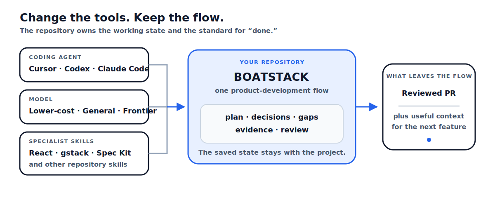
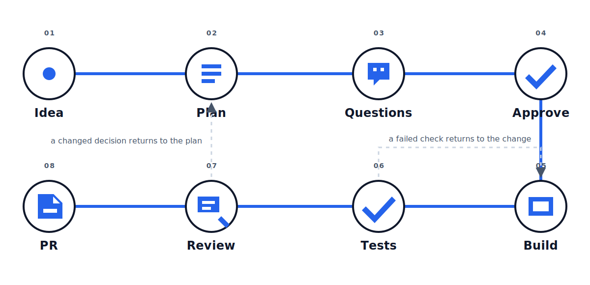

<!-- Generated from operatorstack/intelligence-flow. Edit the upstream public source, not this file. -->

<p align="center">
  
</p>

<h1 align="center">Boatstack</h1>

<p align="center"><strong>Build freely. Prove it. Ship.</strong></p>

## A delivery harness for AI coding agents

<!-- boatstack-claim:portable-product-flow -->Boatstack connects the work from an idea to a reviewed PR. Keep using Cursor, Codex, or Claude Code, with the models and specialist skills that fit the work. Boatstack keeps the plan, decisions, gaps, tests, review findings, and project context connected along the way.

The agent remains free to build. Before it says the work is done, Boatstack asks for the approval, tests, review, and recorded evidence appropriate to the change.

**Your product development flow stays with the repository—not the coding agent.** Change tools without rebuilding how you ship or redefining what “done” means. Boatstack carries the workflow and saved project state—not an agent's private chat history or a command already in progress.

<p align="center">
  
</p>

| You change | Boatstack keeps |
|---|---|
| Cursor, Codex, or Claude Code | The same path from planning through PR preparation |
| Lower-cost, general, or frontier model | The same approval, testing, and review requirements |
| React guidance, gstack, Spec Kit, or another skill | Human approval and evidence remain authoritative |
| Session, worktree, or feature | Durable decisions, gaps, evidence, and code state in the repository |

## Install with your coding agent

Copy this into Cursor, Codex, or Claude Code while the repository is open:

```text
Install Boatstack in this repository from https://github.com/operatorstack/boatstack. Detect whether you are running in Cursor, Codex, or Claude Code; create or use a chore/install-boatstack branch; run the official installer for this operating system; default to core unless I request gstack or Spec Kit; keep all portable host adapters; run Boatstack doctor; show me the generated files and installation diff; and prepare the installation PR without merging it or starting product work.
```

Install Boatstack in its own infrastructure PR and merge it before starting a feature. Install once per Git clone; linked worktrees reuse the verified runtime and restore their ignored local helper automatically.

## Start with two moves

1. Create and save a plan in your coding tool's Plan mode.
2. Run `/auto-plan`.

That is all you need to learn up front. Boatstack shows one next action at a time through approval, building, tests, review, and PR preparation.

When you are ready, that guidance moves through `/plan-gate` → `/build` → `/test-gate` → `/review-gate` → `/ship-gate`.

> The diagram shows what Boatstack guides—not a checklist you need to memorize.

<p align="center">
  
</p>

## Features

- **A guided path from idea to PR.** Start with `/auto-plan`; Boatstack presents one next action at a time through planning, approval, build, validation, review, and PR preparation.
- **Human decisions stay human.** Material product questions remain open until a person answers them, and implementation waits for explicit approval.
- **Evidence tied to the promise.** Tests and checks map to the outcomes the change claims to deliver instead of treating one green command as proof of everything.
- **Context that survives the feature.** Plans, decisions, accepted gaps, evidence, review findings, and code state can inform the next feature rather than disappearing with the chat.
- **Safer agent execution.** High-confidence destructive recovery is stopped before execution; phased work is gated and published one approved delivery slice at a time.
- **Reviewer-ready pull requests.** Boatstack carries the reason, actual changes, validation, risks, gaps, rollout, and rollback into a focused PR brief.
- **Portable across your AI stack.** Cursor, Codex, Claude Code, different model tiers, and specialist skills use the same repository-owned delivery contract.
- **Repository-friendly maintenance.** Linked worktrees restore their verified runtime automatically, while Boatstack updates stay isolated in reviewable infrastructure PRs.

You remain free to build however the work requires. Boatstack governs claims of approval, completion, review, and shipping—not the implementation technique.

## How Boatstack fits into your AI stack

| Part | Its job |
|---|---|
| **Coding agent** — Cursor, Codex, or Claude Code | Executes the work in your repository |
| **Model** — lower-cost, general, or frontier | Reasons, writes, and evaluates within the agent |
| **Skill** — React guidance, gstack, Spec Kit, or another specialty | Adds expertise for a particular kind of work |
| **Boatstack** | Carries the delivery path, saved context, and proof of completion across them |

Boatstack does not replace the agent, model, or skills. It is the repository-local delivery harness that keeps their work connected to the product decision and the standard for calling it complete.

> **Designed for model flexibility · Quality uplift evaluation in progress**

- <!-- boatstack-claim:model-neutral-contract -->**Verified:** the same completion requirements apply regardless of model, provider, or price.
- <!-- boatstack-claim:cross-model-failures -->**Observed:** benchmark runs exposed failures in protocol handling, context, verification, and recovery—not only model capability.
- <!-- boatstack-claim:lower-cost-outcomes -->**Being evaluated:** whether this improves product quality, cost, or delivery time with lower-cost models.

This does not mean every model performs equally. [See the evidence and paired evaluation design](docs/why-these-steps.md#model-choice-and-budget).

## Why these steps?

They come from coding failures observed in benchmark and product-repository work—not guesses. Every safeguard links what happened, what Boatstack now does, and whether that behavior has actually been tested.

| What happened | What Boatstack does | Current evidence |
|---|---|---|
| <!-- boatstack-claim:human-decisions -->The agent guessed a product decision | Records a human answer and approval before code | Approval and drift tests |
| <!-- boatstack-claim:validation-provenance -->A passing test was used to support a broader claim | Links each promised outcome to its validation | Coverage and plan-compiler tests |
| <!-- boatstack-claim:irreversible-operations -->A failed write led to an invented reset path | Denies high-confidence destructive recovery | Hook behavior verified; outcome benefit still being evaluated |
| <!-- boatstack-claim:reviewer-ready-pr -->A PR lost decisions and accepted gaps | Builds a review brief from scope, diff, and evidence | Projection and stale-preview tests |
| <!-- boatstack-claim:phase-scoped-delivery -->A phased plan opened PRs during build | Gates and publishes one delivery slice at a time | Slice-state and bypass tests |
| <!-- boatstack-claim:git-worktree-activation -->A worktree had the hook but not its ignored helper | Restores the verified local runtime before judging the command | Linked-worktree and tamper tests |

[Read what happened, what is tested, and what remains open](docs/why-these-steps.md). The [claim record](docs/public-claims.json) keeps every material statement tied to its sources.

## A small example

A request said, “Add a password reset button,” but the product used passwordless sign-in and had no reset route. Boatstack surfaced the conflict instead of building the button literally. The human chose dual authentication; later, review caught an unsafe recovery-session assumption and returned the change for repair before PR preparation.

[Follow the sanitized walkthrough](docs/account-recovery-walkthrough.md) or [ship your first feature](docs/getting-started.md).

## Updates stay out of product work

<!-- boatstack-claim:visible-updates -->After a PR is published, Boatstack may report a new stable release without changing the feature branch. `/boatstack-update` prepares a separate infrastructure branch, shows the diff, and waits for `open update PR`. It never merges the update.

<details>
<summary><strong>Install manually</strong></summary>

macOS or Linux:

```bash
git switch -c chore/install-boatstack
/bin/bash -c "$(curl -fsSL https://raw.githubusercontent.com/operatorstack/boatstack/main/install.sh)"
```

Windows PowerShell:

```powershell
git switch -c chore/install-boatstack
irm https://raw.githubusercontent.com/operatorstack/boatstack/main/install.ps1 | iex
```

The installer previews generated paths, verifies the platform helper, offers optional integrations, runs a smoke check, and prints the files to commit. Boatstack core requires no Python, Node, Go, or package manager.

</details>

## Find what you need

**Start:** [Getting started](docs/getting-started.md) · [Generated files](docs/generated-files.md) · [Troubleshooting](docs/troubleshooting.md)

**Inspect:** [Why these steps](docs/why-these-steps.md) · [Validation and evidence](docs/validation-and-evidence.md) · [Safety](docs/safety.md)

**Go deeper:** [Evidence-engineered coding](docs/evidence-engineered-coding.md) · [Research and design](docs/research-and-design.md) · [Contributing](CONTRIBUTING.md)

## Project status

Boatstack is an open-source research prototype. Its workflow and enforcement behavior are tested, but the current record does not prove improved product-delivery success. A paired feature-building benchmark—same model, task, and budget with and without Boatstack—is the next evaluation.

Exact Intelligence Flow provenance and generated file hashes are recorded in [`UPSTREAM.json`](UPSTREAM.json).
