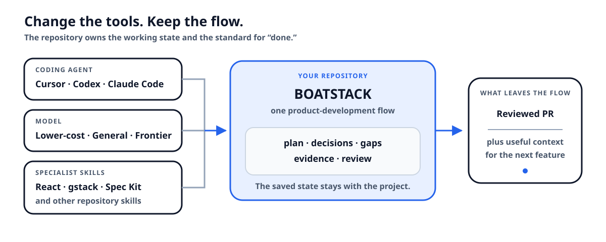
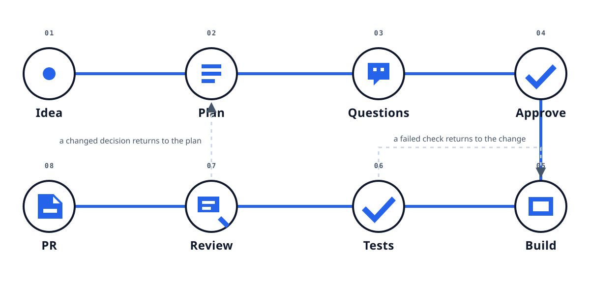

<p align="center">
  
</p>

<h1 align="center">Boatstack</h1>

<p align="center"><strong>Build freely. Prove it. Ship.</strong></p>

## Keep your software delivery process when you change coding agents

Boatstack is a repository-local delivery harness for Cursor, Codex, Claude Code, and Gemini CLI.

AI coding agents write code quickly. But each tool brings its own planning flow, session state, and definition of "done". If you change agents, your delivery process often disappears with the chat.

<!-- boatstack-claim:portable-product-flow -->Boatstack keeps the delivery process in the repository. Your plans, product decisions, tests, review findings, accepted gaps, and completion evidence stay connected from idea to pull request. This holds no matter which agent or model does the work. Use Cursor, Codex, Claude Code, or Gemini CLI. Boatstack keeps the same approval, testing, review, and shipping boundaries across all of them.

**Your product development flow stays with the repository, not the coding agent.** Change agents, models, or specialist skills without rebuilding how your team plans, verifies, reviews, and ships software.

The coding agent executes the work. Boatstack supervises the delivery. Your repository owns the policy and evidence.

<p align="center">
  
</p>

| You change | You keep |
|---|---|
| Cursor, Codex, Claude Code, or Gemini CLI | The same path from approved plan to reviewed PR |
| Lower-cost, general, or frontier model | The same definition of done and proof requirements |
| React guidance, gstack, Spec Kit, or another skill | Human product decisions remain authoritative |
| Session, worktree, or feature | Decisions, open gaps, evidence, and verified delivery state |

## How it works

1. Save a plan in your coding agent.
2. Boatstack validates the plan and pauses for material product decisions.
3. The agent builds freely inside the approved scope.
4. Boatstack checks the promised outcomes against tests and evidence.
5. Review findings, risks, and accepted gaps become a focused PR brief.
6. The resulting context stays in the repository for the next feature.

## Each delivery makes the next one easier

Boatstack does not preserve an agent's private reasoning or replay old chats. It keeps the durable parts of delivery:
- approved product decisions
- unresolved gaps
- validation evidence
- review findings
- verified repository state

So the next feature starts from recorded project knowledge. You do not reconstruct intent from another agent session.

## Prevent systemic failure instead of patching symptoms

When coding agents or developers meet a bug, they usually patch the local symptom. The underlying architectural flaw stays open — for example, a database edge that accepts bad data. The same failure then happens again elsewhere.

When you ask for a fix during `/auto-plan`, Boatstack scans your codebase. It checks whether the bug is a symptom of a missing systemic boundary. If it is, Boatstack pauses instead of patching the symptom. It then asks whether you want to add a programmatic lock, such as a database trigger or a strict validator.

To diagnose a bug first, run `/root-cause <symptom-or-log>` and paste a stack trace, an error, or a failing signal. The operation is strictly read-only. It locates the failure below its surface symptom. It names the failure *class*. It traces a cited root-cause chain, maps the blast radius, and proposes the structural change that removes the whole class. It ends with a source plan. Save that plan and pass it to `/auto-plan --plan <path>`, the diagnostic front door to the plan gate.

Boatstack turns one-off bug fixes into systemic constraints, so your codebase gets safer with every agent run. It requires a negative test that proves the new lock holds. On publication, it records that verified boundary in the repository's global memory. All future agent runs are then bound by the new rule.

## Install with your coding agent

Copy this into Cursor, Codex, Claude Code, or Gemini CLI while the repository is open:

```text
Install Boatstack in this repository from https://github.com/operatorstack/boatstack. Detect whether you are running in Cursor, Codex, Claude Code, or Gemini CLI; create or use a chore/install-boatstack branch; run the official installer for this operating system; default to core unless I request gstack or Spec Kit; keep all portable host adapters; run Boatstack doctor; show me the generated files and installation diff; and prepare the installation PR without merging it or starting product work.
```

Install Boatstack in its own infrastructure PR. Merge that PR before you start a feature. After that one repository adoption, fresh clones and linked worktrees inherit tracked launchers that activate the exact verified runtime automatically.

## Start with two moves

1. Create and save a plan in your coding tool's Plan mode.
2. Start Boatstack with the entry point for your host.

| Host | Start command |
|---|---|
| Claude Code | `/auto-plan` |
| Cursor | `/auto-plan` |
| Gemini CLI | `/auto-plan` |
| Codex | `$boatstack auto-plan` |

That is all you need to learn up front. Boatstack shows one next action at a time through approval, building, tests, review, and PR preparation.

When you return after an interruption, run `/boatstack-next` in Claude Code, Cursor, or Gemini CLI. In Codex, run `$boatstack next`. Boatstack reports the repository-verified stage and one next action. It does not change state. It tells apart a feature that has not started from one that is complete.

`/boatstack-run --to plan|verified|pr` (or `$boatstack run --to …` in Codex) starts from one saved plan and stops at the selected goal. An explicit goal-driven run can resolve only low-risk, reversible, evidence-backed implementation choices inside the specification. Any material or uncertain choice still pauses. The `pr` target authorizes one normal PR open or update; it never merges or deploys.

In Claude Code, Cursor, and Gemini CLI, that guidance moves through `/plan-gate` → `/build` → `/test-gate` → `/review-gate` → `/ship-gate`. In Codex, use the same operation names after `$boatstack`.

> The diagram shows what Boatstack guides. It is not a checklist you must memorize.

<p align="center">
  
</p>

## Change course without losing the delivery

After Build, describe changes normally. Boatstack records them, keeps valid work, and resumes at the earliest boundary. You do not need to remember a repair command. Ordinary CI failures, review findings, and denied publication attempts route automatically for active deliveries and published PRs.

```text
"This is wrong" → record → repair → test → review
                         ↘ changed intent → approve delta
```

Receipts stay as history. Published corrections become independently approved, linked deliveries. Boatstack updates an open PR after fresh gates. For merged or closed work, it opens a new PR.

## What you get

- **Change coding agents without changing how you ship.**
- **Resume work without reconstructing the previous chat.**
- **Stop agents from guessing material product decisions.**
- **Require evidence for every outcome the change claims to deliver.**
- **Create reviewer-ready PRs from the actual scope, changes, risks, and validation.**

<details>
<summary>Technical Features</summary>

- **A guided path from idea to PR.** `/auto-plan` starts a one-action-at-a-time delivery flow.
- **Instant orientation after a break.** `boatstack next` reconstructs the verified stage. It does not treat chat or a running process as workflow evidence. You resume in seconds instead of re-reading history.
- **Human decisions stay human.** Material product questions stay open until a person answers them. Implementation waits for explicit approval.
- **Evidence tied to the promise.** Tests and checks map to the outcomes the change claims to deliver. One green command is not proof of everything.
- **Context that survives the feature.** Plans, decisions, gaps, evidence, and code state stay useful beyond the chat.
- **Conversational repair after Build.** Describe what changed. Boatstack keeps valid work and reruns only the affected boundaries.
- **Safer agent execution.** High-confidence destructive recovery is stopped before execution; phased work is gated and published one approved delivery slice at a time.
- **Reviewer-ready pull requests.** Actual changes, evidence, risks, rollout, and rollback become a focused PR brief. Reviewers spend time on judgment, not reconstruction.
- **Optional repository changelog.** Require readable `CHANGELOG.md` entries grounded in actual changes.
- **Portable across your AI stack.** Hosts, models, and skills share one repository-owned delivery contract.
- **Repository-friendly maintenance.** Worktrees restore runtime. Updates stay in separate infrastructure PRs.

</details>

## Configure repository policy

`.boatstack-project.json` controls three things: the project commands and context Boatstack uses, the coding hosts it supports, and the opt-in policies for changelogs, boundary analysis, high-risk review, and feature workspaces. [Choose the outcomes you want and see every configuration field](docs/configuration.md).

## How Boatstack fits into your AI stack

| Part | Its job |
|---|---|
| **Coding agent** — Cursor, Codex, Claude Code, or Gemini CLI | Executes the work in your repository |
| **Model** — lower-cost, general, or frontier | Reasons, writes, and evaluates within the agent |
| **Skill** — React guidance, gstack, Spec Kit, or another specialty | Adds expertise for a particular kind of work |
| **Boatstack** | Carries the delivery path, saved context, and proof of completion across them |

Boatstack is a repository-local delivery harness.

> **Designed for model flexibility · Quality uplift evaluation in progress**

- <!-- boatstack-claim:model-neutral-contract -->**Verified:** the same completion requirements apply regardless of model, provider, or price.
- <!-- boatstack-claim:cross-model-failures -->**Observed:** benchmark runs exposed failures in protocol handling, context, verification, and recovery — not only model capability.
- <!-- boatstack-claim:lower-cost-outcomes -->**Being evaluated:** whether this improves product quality, cost, or delivery time with lower-cost models.

This does not mean every model performs equally. [See the evidence and evaluation design](docs/research-and-design.md#evaluation-of-the-finished-node).

## Built from failures observed in real coding work

These behaviors come from coding failures observed in benchmark and product work, not from guesses. When a failure reveals a reusable delivery problem rather than a project-specific mistake, Boatstack turns it into a boundary that future runs enforce. Each link explains what happened, what Boatstack does, and whether that behavior has actually been tested.

| What happened | What Boatstack does | Current evidence |
|---|---|---|
| <!-- boatstack-claim:human-decisions -->The agent guessed a product decision | Records a human answer and approval before code | Approval and drift tests |
| <!-- boatstack-claim:validation-provenance -->A passing test was used to support a broader claim | Links each promised outcome to its validation | Coverage and plan-compiler tests |
| <!-- boatstack-claim:irreversible-operations -->A failed write led to an invented reset path | Denies high-confidence destructive recovery | Hook behavior verified; outcome benefit still being evaluated |
| <!-- boatstack-claim:reviewer-ready-pr -->A PR lost decisions and accepted gaps | Builds a review brief from scope, diff, and evidence | Projection and stale-preview tests |
| <!-- boatstack-claim:phase-scoped-delivery -->A phased plan opened PRs during build | Gates and publishes one delivery slice at a time | Slice-state and bypass tests |
| <!-- boatstack-claim:git-worktree-activation -->A feature worktree lost its helper or stranded its validated plan | Verifies the pinned runtime and moves the exact planning package before approval or autonomy | Linked-worktree, identity, rollback, and plan-fingerprint tests |

The [claim record](docs/public-claims.json) keeps every material statement tied to its sources and tests.

## A small example

A request asked to "Add a password reset button". But the product used passwordless sign-in. Boatstack flagged the conflict. The developer chose dual authentication. Later, review caught an unsafe recovery assumption and prompted a repair.

[Follow the sanitized walkthrough](docs/account-recovery-walkthrough.md) or [ship your first feature](docs/getting-started.md).

## Updates stay out of product work

<!-- boatstack-claim:visible-updates -->After you publish a PR, Boatstack may report a new stable release. It does not change the feature branch. `/boatstack-update` prepares a separate infrastructure branch, shows the diff, and waits for `open update PR`. It never merges the update.

<details>
<summary><strong>Install manually</strong></summary>

macOS or Linux:

```bash
git switch -c chore/install-boatstack
/bin/bash -c "$(curl -fsSL https://raw.githubusercontent.com/operatorstack/boatstack/main/install.sh)"
```

Windows PowerShell:

```powershell
git switch -c chore/install-boatstack
irm https://raw.githubusercontent.com/operatorstack/boatstack/main/install.ps1 | iex
```

The installer previews generated paths, verifies the platform helper, offers optional integrations, runs a smoke check, and prints the files to commit. Boatstack core requires no Python, Node, Go, or package manager.

</details>

## Find what you need

**Start:** [Getting started](docs/getting-started.md) · [Files](docs/generated-files.md) · [Troubleshooting](docs/troubleshooting.md)

**Inspect:** [Research and design](docs/research-and-design.md) · [Validation and evidence](docs/validation-and-evidence.md) · [Safety](docs/safety.md)

**Go deeper:** [Coding](docs/evidence-engineered-coding.md) · [Design](docs/research-and-design.md) · [Contributing](CONTRIBUTING.md)

## Project status

Boatstack is an open-source research prototype. Its workflow and enforcement behavior are tested. But the current record does not prove improved delivery success. The next evaluation is a paired feature benchmark with the same model, task, and budget.

Boatstack is developed directly in this repository. The immutable provenance of the final historical import is recorded in [`IMPORT_PROVENANCE.json`](IMPORT_PROVENANCE.json).
